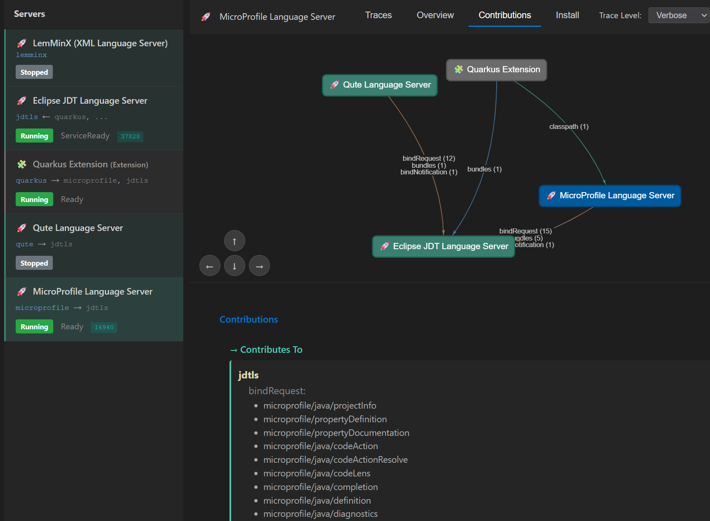

# Getting Started with MCP Language Tools

## Quick Start (5 minutes)

Get AI-powered code validation with language servers in 4 steps.

---

## Step 0: Get the Code

### Fork and Clone

1. **Fork the repository** on GitHub:
   - Go to https://github.com/angelozerr/mcp-languagetools
   - Click **Fork** button

2. **Clone your fork**:
   ```bash
   git clone https://github.com/YOUR-USERNAME/mcp-languagetools.git
   cd mcp-languagetools
   ```

**Prerequisites**:
- ✅ Java 17 or higher
- ✅ Maven (or use included `./mvnw`)
- ✅ MCP Client installed:
  - **[Claude Desktop](https://claude.ai/download)** (recommended), or
  - **[Bob IDE/Shell](https://bob.ibm.com/)** (IBM's AI assistant)

---

## Step 1: Launch MCP Language Tools

### Start the server

**Important**: Launch from the `dev/` module to load all language servers.

```bash
cd mcp-languagetools/dev
../mvnw quarkus:dev
```

**Or from the root**:
```bash
cd mcp-languagetools
./mvnw quarkus:dev -f dev/pom.xml
```

**Why `dev`?**  
The project structure is:
- `core/` - Base MCP server (no language servers)
- `extensions/` - Individual language servers (JDT.LS, MicroProfile, Qute, etc.)
- `dev/` - **Pre-configured with all extensions**

Running from `dev/` automatically:
- ✅ Loads JDT.LS (Java)
- ✅ Loads MicroProfile LS
- ✅ Loads Qute LS  
- ✅ Loads LemMinX (XML)
- ✅ Configures extension relationships (bindings, contributions)

**Wait for**:
```
Listening on: http://localhost:7654
```

✅ **Server is ready with all language servers!**

---

## Step 2: Configure Claude, Bob

### Add MCP Language Tools to Claude, Bob

See doc at Claude/Bob to register MCP Server like this:

```json
{
  "mcpServers": {
    "mcp-languagetools": {
      "type": "http",
      "url": "http://localhost:7654/mcp"
    }
  }
}
```

### Restart Claude/Bob

Close and reopen Claude.

### Open a project folder in Claude

```shell
cd microprofile-health-3
claude
```

```shell
cd microprofile-health-3
bob
```

## Step 3: Try It Out - MicroProfile Example

### The Scenario

You have a Java file with a MicroProfile Health Check missing required annotation:

**File**: `src/main/java/org/acme/MyLivenessCheck.java`
```java
package org.acme;

import org.eclipse.microprofile.health.HealthCheck;
import org.eclipse.microprofile.health.HealthCheckResponse;

public class MyLivenessCheck implements HealthCheck {

    @Override
    public HealthCheckResponse call() {
        return HealthCheckResponse.up("alive");
    }

}
```

**Problem**: Missing `@Liveness` annotation!

---

### Ask Claude/Bob

**You type**:
```
Could you validate MyLivenessCheck with MCP?
```

**Claude/Bob responds**:


```
 MCP Validation for MyLivenessCheck:

  ⚠️ Warning - Line 6: The class org.acme.MyLivenessCheck implementing the HealthCheck interface should use the
  @Liveness, @Readiness or @Startup annotation.
```

---

### What Just Happened?

Behind the scenes (visible in Admin UI at `http://localhost:7654/admin`):

1. **Claude called MCP tool** `getDiagnostics`:

```json
{
  "method": "tools/call",
  "params": {
    "name": "getDiagnostics",
    "arguments": {
      "cwd": "/home/my-microprofile-app",
      "fileUri": "file://home/microprofile-health-3/src/main/java/org/acme/MyLivenessCheck.java"
    },
    "_meta": {
      "claudecode/toolUseId": "toolu_vrtx_013Y6mGDT3JZQwnnACeaPSey",
      "progressToken": 1
    }
  },
  "jsonrpc": "2.0",
  "id": 1
}
```

2. **MicroProfile LS analyzed the file**:
   - Detected `HealthCheck` implementation
   - Validated against MicroProfile Health spec
   - Found missing `@Liveness`, `@Readiness` or `@Startup` annotation.

3. **MCP returned diagnostic**:

```json
{
  "jsonrpc": "2.0",
  "id": 1,
  "result": {
    "isError": false,
    "content": [
      {
        "text": "Diagnostics for: file:///home/microprofile-health-3/src/main/java/org/acme/MyLivenessCheck.java\n\nLanguage Server: microprofile (MicroProfile Language Server)\n  [Warning] Line 6: Either [\r\n  left \u003d The class org.acme.MyLivenessCheck implementing the HealthCheck interface should use the @Liveness, @Readiness or @Startup annotation.\r\n  right \u003d null\r\n]\n\n",
        "type": "text"
      }
    ]
  }
}
```

---

## View in Admin UI

Open `http://localhost:7654/admin` in your browser:

### Workspaces Tab


**See**:
- ✅ Your workspace listed
- ✅ Claude Code connected as MCP client
- ✅ JDT.LS and MicroProfile servers running

### LSP Traces


### MCP Traces


### Server Contributions



---

## Supported Languages

Out of the box:
- ✅ **Java** (JDT.LS)
- ✅ **MicroProfile** (config, metrics, health, etc.)
- ✅ **Qute Templates** (Qute LS)
- ✅ **XML** (LemMinX) - server.xml, pom.xml, etc.
- ✅ **Properties files**

---

## Next Steps

### Explore the Admin UI
- Open `http://localhost:7654/admin`
- Click through **Workspaces**, **Servers**, **Debuggers**, **MCP** tabs
- Watch real-time traces
- View contribution diagrams

### Add More Languages
Check `extensions/` folder for available language servers:
- `jdtls` - Java
- `microprofile` - MicroProfile
- `qute` - Qute templates
- `lemminx` - XML

### Try Advanced Features
- Ask Claude to fix validation errors
- Request code navigation (references, definitions)
- Search for symbols across workspace

---

## Troubleshooting

### ⚠️ First Request May Fail (POC Limitation)

**Known issue**: The first validation request may return no diagnostics because JDT.LS takes time to initialize and index your project.

**Solution**: Simply **ask Claude again** after a few seconds. Subsequent requests will work correctly.

**Why this happens**: This is a POC limitation. JDT.LS initialization happens asynchronously, and the first MCP tool call may execute before indexing completes. This timing issue will be addressed in future versions.

**Monitor initialization** in Admin UI:
1. Open `http://localhost:7654/admin` → **Workspaces** tab
2. Check JDT.LS status: `Starting` → `Running` (wait for green status)
3. Once green, retry your Claude request

---

### Claude doesn't see the tools

**Check**:
1. MCP server is running: `http://localhost:7654/mcp`
2. Claude Desktop config is correct
3. Restarted Claude Desktop after config change

### No diagnostics showing

**Check** in Admin UI:
1. Workspace is opened (Workspaces tab)
2. Language servers are running (green status)
3. File was opened/saved (triggers LSP analysis)
4. **Try the request again** (see "First Request May Fail" above)

### Server fails to start

**Check** in Admin UI → Servers tab:
- Look for error status (red icon)
- Click server to see error logs
- Verify Java 17+ is installed for JDT.LS

---

## Understanding What Happened - Deep Dive in Admin UI

Now that you've seen it work, let's understand **exactly** what happened behind the scenes using the Admin UI.

📖 **[Open the complete Admin UI Guide](./admin-ui.md)** for full details

### Replay: The MicroProfile Health Check Example

Remember when Claude found the missing `@Liveness` annotation in `MyLivenessCheck.java`? 

Let's trace the complete flow in the Admin UI.

---

## What's Next?

### Continue Learning

📖 **[Admin UI Complete Guide](./admin-ui.md)** - All features, workflows, and tips  
📖 **[Bind Mechanism](./bind-mechanism.md)** - How servers collaborate (deep dive)  
📖 **[Extension System](./extensions.md)** - Add your own language servers  

### Try More Examples

- **Ask Claude to fix the error**: "Can you add the @Liveness annotation to MyLivenessCheck?"
- **Find references**: "Where is MyLivenessCheck used in the project?"
- **Explore symbols**: "List all health checks in this codebase"
- **Multi-file analysis**: "Find all health check classes missing required annotations in this project"

### Explore Admin UI Features

- **Contributions tab**: See how MicroProfile depends on JDT.LS (diagram!)
- **Servers tab**: Start/Stop/Restart language servers
- **DAP tab**: Debug adapters (experimental)
- **Real-time monitoring**: Leave Admin UI open while using Claude

---

## Summary

You've learned:
✅ How to start MCP Language Tools  
✅ How to connect Claude Desktop  
✅ How to get AI-powered validation  
✅ **How it all works under the hood** (MCP + LSP traces)  
✅ How to debug and understand with Admin UI  

**MCP Language Tools makes the invisible visible** - that's the difference! 🔍

**Now try it with your own projects!** 🚀

